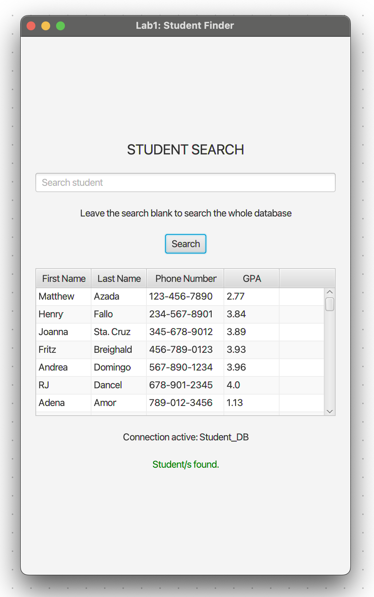

# Student Search

Student Search is a simple Java desktop application that searches a given mySQL database
for students based on their names. The results are displayed in a table for viewing.

It used JavaFX and SceneBuilder to create the GUI components and JDBC to establish a
connection with the local mySQL server.

- [ ] Add ALL CRUD operations
- [ ] Create
- [ ] Read
- [ ] Update
- [ ] Delete
